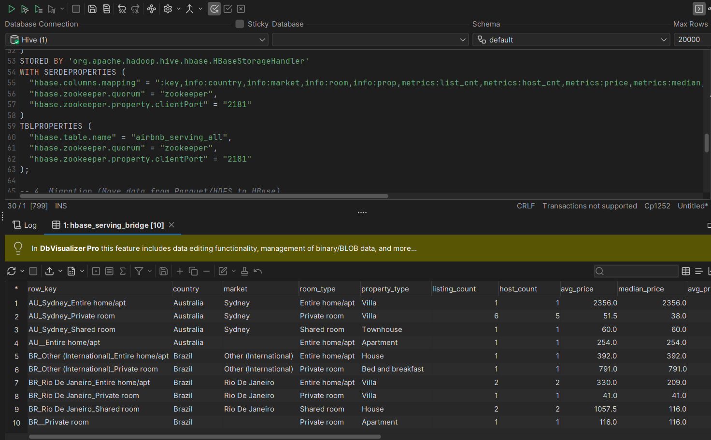
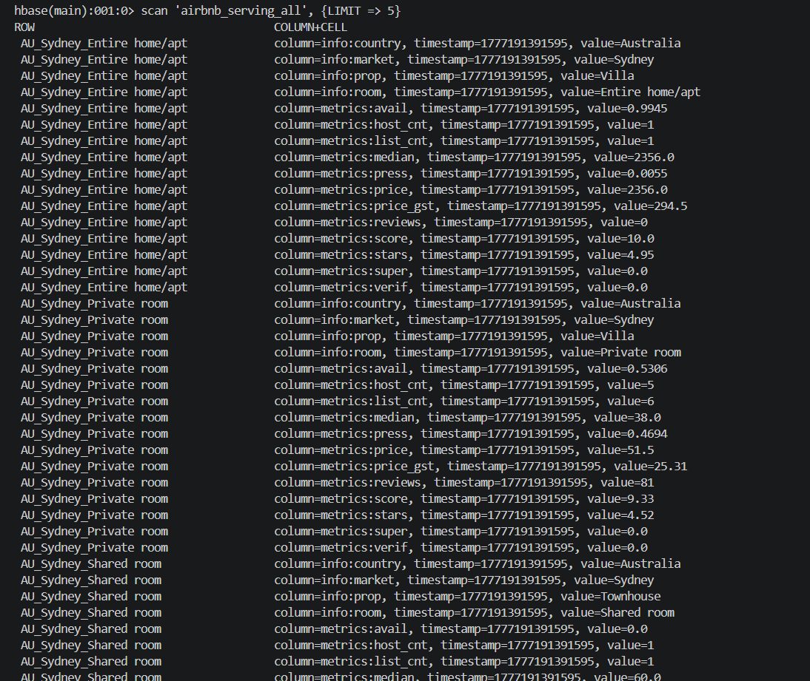

# Airbnb Big Data Pipeline


This project implements a local big-data pipeline for an Airbnb sample collection. It extracts data from MongoDB Atlas, processes it via Apache Spark, orchestrates with Hadoop (HDFS/YARN), manages metadata and queries with Apache Hive, and serves it through Apache HBase.

## 🗂️ Project Structure

Below is the layout of the project's ecosystem:

- **[`notebooks/`](notebooks/)**: Contains Jupyter notebooks for development and Spark ingestion jobs (e.g., `mongo_airbnb_to_parquet.ipynb`).
- **[`docs/`](docs/)**: In-depth repository documentation (`architecture.md`), SQL scripts for Hive table creation & HBase mapping, and query screenshots within `results/`.
- **[`hive-conf/`](hive-conf/)**: Configuration settings for the Apache Hive environment (`hive-site.xml`) and the metastore initialization.
- **[`hive/`](hive/)**: Dedicated for Hive-specific scripts, configurations, or localized storage.
- **[`spark/`](spark/)**: Dedicated for standalone Apache Spark scripts or jobs apart from notebooks.
- **`docker-compose.yml`**: Defines the robust Docker environment consisting of Hadoop, Spark, Hive, ZooKeeper, and HBase.

## 🛠️ Tech Stack & Pipeline Data Flow

1. **MongoDB Atlas** (`sample_airbnb.listingsAndReviews`): The starting data source containing nested JSON documents.
2. **Apache Spark (Compute)**: Extracts, filters, transforms, and flattens the nested data. Output is partitioned and pushed directly into HDFS.
3. **Hadoop Data Lake (HDFS)**: Stores `raw` partitioned snapshots, `clean` tables, and `analytics` summaries natively in the Parquet format. 
4. **Apache Hive (Metadata & Schema Management)**: Provides step-up tables, scheme mappings, and SQL querying interfaces over the distributed Parquet files.
5. **Apache HBase (Target Data Store)**: Low-latency target storage for serving processed analytics data globally. Managed effectively through ZooKeeper.

## 🚀 Setup & Execution

### 1. Configuration
Create a local environment file from the provided template:
```bash
cp env.example .env
```
Edit `.env` and set `MONGODB_URI` to your Atlas connection string. *(Never commit `.env`)*. `AIRBNB_INGEST_DATE` can be kept empty to map the run date, or given a specific date for reproducible runs.

### 2. Services Initialization
Start the default core cluster (HDFS & Spark Base):
```bash
docker compose up -d
```

### 3. Data Ingestion (Spark Job)
Run the Spark processing/notebook ingestion job to extract records from MongoDB into Parquet HDFS layers:
```bash
docker compose run --rm airbnb-ingest
```

### 4. Enable Hive and HBase Layers
To bring up the Hive query capabilities alongside the HBase metadata serving layer:
```bash
docker compose --profile hive up -d
docker compose --profile hbase up -d
```
*(Optional)* Spin up the Jupyter development UI:
```bash
docker compose --profile dev up -d jupyter
```

## 📊 Outputs & Results

### Spark Parquet Outputs to HDFS:
- **Raw Partitioning**: `hdfs://namenode:9000/data/airbnb/raw/listingsAndReviews/ingest_date=YYYY-MM-DD`
- **Clean Relational Table**: `hdfs://namenode:9000/data/airbnb/clean/listings`
- **Analytics Target Summary**: `hdfs://namenode:9000/data/airbnb/analytics/market_room_type_summary`

### Apache Hive Query Execution
After ingestion concludes, register schemas in Hive and query cleanly parsed data schemas (referencing scripts under `docs/` such as `hive_airbnb_clean.sql`):


### Apache HBase Target Storage
Final HBase lookups mapping key values for high-speed delivery using the Hive-to-HBase handoff:


## 📖 Further Documentation
Please see [**`docs/architecture.md`**](docs/architecture.md) for full descriptions mapping the pipeline node responsibilities, cluster profile configurations, SQL design definitions, and the pipeline's expected end state.
