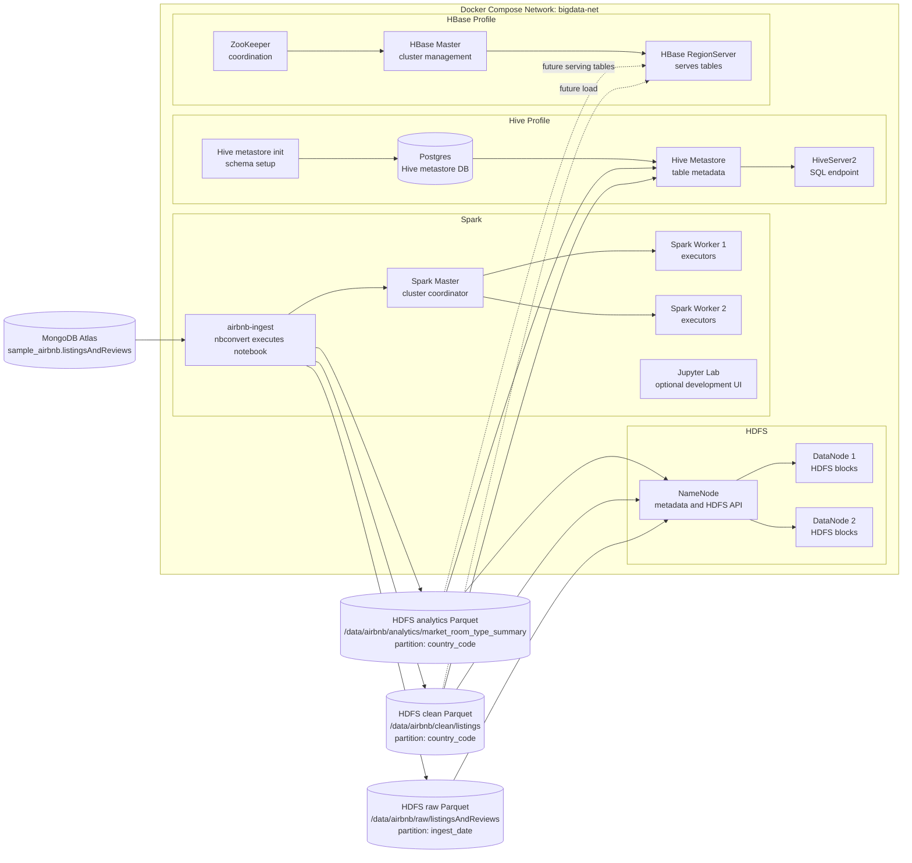

# Airbnb Big Data Pipeline Architecture

This project is a local big-data environment for moving MongoDB Atlas sample Airbnb data into Hadoop storage, transforming it with Spark, exposing it to Hive, and preparing it for an HBase serving layer.

The current implemented pipeline is:

```text
MongoDB Atlas sample_airbnb.listingsAndReviews
  -> Spark notebook job
  -> HDFS Parquet raw layer
  -> HDFS Parquet clean layer
  -> HDFS Parquet analytics layer
  -> Hive external tables
  -> HBase handoff design
```

The Spark job is implemented in:

```text
notebooks/mongo_airbnb_to_parquet.ipynb
```

The Docker environment is defined in:

```text
docker-compose.yml
```

## Architecture Diagram

Plain-text view:

```text
MongoDB Atlas
  |
  v
airbnb-ingest notebook job
  |
  +--> Spark Master -> Spark Workers
  |
  +--> HDFS raw Parquet       /data/airbnb/raw/listingsAndReviews/ingest_date=...
  +--> HDFS clean Parquet     /data/airbnb/clean/listings/country_code=...
  +--> HDFS analytics Parquet /data/airbnb/analytics/market_room_type_summary/country_code=...
                              |
                              v
                         Hive external tables
                              |
                              v
                    Future HBase serving tables
```

Rendered view:



## Compose Profiles

The Compose file is intentionally split into a small default stack and optional profiles.

| Profile | Services | Purpose |
| --- | --- | --- |
| default | `namenode`, `datanode1`, `datanode2`, `spark-master`, `spark-worker-1`, `spark-worker-2` | Minimum HDFS and Spark runtime |
| `jobs` | `airbnb-ingest` | One-shot notebook execution job |
| `hive` | `hive-metastore-db`, `hive-metastore-init`, `hive-metastore`, `hiveserver2` | SQL metadata and Hive query layer |
| `hbase` | `zookeeper`, `hbase-master`, `hbase-regionserver` | HBase serving layer foundation |
| `dev` | `jupyter` | Interactive notebook development |
| `yarn` | `resourcemanager`, `nodemanager`, `historyserver` | Optional Hadoop YARN components |

Default startup:

```bash
docker compose up -d
```

Run the ingestion job:

```bash
docker compose run --rm airbnb-ingest
```

Start optional Hive services:

```bash
docker compose --profile hive up -d
```

Start optional HBase services:

```bash
docker compose --profile hbase up -d
```

## Environment Variables

Runtime configuration lives in `.env`, created from `env.example`.

| Variable | Meaning |
| --- | --- |
| `MONGODB_URI` | MongoDB Atlas connection string. Required for ingestion. |
| `MONGODB_DATABASE` | Source database. Defaults to `sample_airbnb`. |
| `MONGODB_COLLECTION` | Source collection. Defaults to `listingsAndReviews`. |
| `AIRBNB_RAW_PATH` | HDFS raw Parquet output path. |
| `AIRBNB_INGEST_DATE` | Optional raw partition date in `YYYY-MM-DD` format. Empty means use the run date. |
| `AIRBNB_RAW_FULL_REFRESH` | `true` rewrites the full raw table into partitioned layout. Normal runs keep this `false`. |
| `AIRBNB_CLEAN_PATH` | HDFS clean Parquet output path. |
| `AIRBNB_ANALYTICS_PATH` | HDFS analytics summary output path. |
| `SPARK_WORKER_MEMORY` | Memory assigned to each Spark worker. |
| `SPARK_WORKER_CORES` | Cores assigned to each Spark worker. |
| `SPARK_OUTPUT_PARTITIONS` | Target output file parallelism. |
| `SPARK_SQL_SHUFFLE_PARTITIONS` | Spark SQL shuffle partition count. |
| `MONGO_SPARK_CONNECTOR_PACKAGE` | Maven coordinate for the MongoDB Spark Connector. |

Do not commit `.env`. It contains credentials.

## Node Responsibilities

### HDFS Nodes

`namenode`

- Owns HDFS namespace metadata.
- Exposes HDFS RPC at `hdfs://namenode:9000`.
- Provides the NameNode web UI on host port `9870`.
- Does not store most data blocks itself; it tracks where blocks live.

`datanode1` and `datanode2`

- Store HDFS file blocks.
- Hold Parquet files written by Spark.
- Provide HDFS storage capacity and replication targets.

### Spark Nodes

`spark-master`

- Coordinates Spark applications.
- Accepts Spark applications at `spark://spark-master:7077`.
- Provides the Spark Master UI on host port `8080`.

`spark-worker-1` and `spark-worker-2`

- Run Spark executor processes.
- Perform distributed reads, transformations, shuffles, and writes.
- Resource sizing is controlled by `SPARK_WORKER_MEMORY` and `SPARK_WORKER_CORES`.

`airbnb-ingest`

- One-shot job container.
- Executes the notebook with `jupyter nbconvert`.
- Reads MongoDB Atlas through the MongoDB Spark Connector.
- Writes raw, clean, and analytics Parquet datasets to HDFS.

`jupyter`

- Optional development UI.
- Mounts the local `notebooks/` directory.
- Useful for editing and testing the Spark notebook interactively.

### Hive Nodes

`hive-metastore-db`

- Postgres database used by Hive to store metadata.
- Stores database names, table schemas, partitions, and table locations.
- Does not store the actual Airbnb data rows.

`hive-metastore-init`

- One-shot initialization container.
- Runs Hive `schematool` to initialize the metastore schema if needed.

`hive-metastore`

- Hive metadata service.
- Lets HiveServer2 and other clients resolve table schemas and HDFS locations.

`hiveserver2`

- SQL endpoint for users and tools.
- Lets users query external Hive tables backed by HDFS Parquet files.

### HBase Nodes

`zookeeper`

- Coordination service required by HBase.
- Tracks cluster state and helps clients locate region servers.

`hbase-master`

- Manages HBase table metadata and region assignments.
- Coordinates the HBase cluster.
- Provides the HBase Master UI on host port `16010`.

`hbase-regionserver`

- Serves HBase table regions.
- Handles reads and writes for HBase tables.
- Stores HBase data on HDFS under `hdfs://namenode:9000/hbase`.

## Spark Layer

Spark is the transformation engine. It reads the nested MongoDB documents and creates three HDFS datasets.

### Raw Layer

Path:

```text
/data/airbnb/raw/listingsAndReviews
```

Partition:

```text
ingest_date=YYYY-MM-DD
```

Purpose:

- Preserve the MongoDB document shape as closely as Spark can represent it.
- Keep a replayable source copy in HDFS.
- Support future batch history if the job runs on multiple days.

For this static sample dataset, `ingest_date` is mostly a production-design feature. It is useful for showing how a real batch ingestion pipeline would preserve daily snapshots, but it is not the best analytical filter for a one-time sample load.

### Clean Layer

Path:

```text
/data/airbnb/clean/listings
```

Partition:

```text
country_code
```

Purpose:

- Flatten nested MongoDB fields into Hive-friendly scalar columns.
- Convert dates, numeric values, booleans, arrays, coordinates, host data, review scores, and availability into queryable columns.
- Store data as Snappy-compressed Parquet.
- Support common geographic queries such as `WHERE country_code = 'US'`.

### Analytics Layer

Path:

```text
/data/airbnb/analytics/market_room_type_summary
```

Partition:

```text
country_code
```

Purpose:

- Provide an immediately useful analytical table.
- Aggregate by country, market, room type, and property type.
- Calculate metrics such as listing count, host count, average price, median price, price per guest, rating quality, booking pressure, superhost rate, host verification rate, and total reviews.

This table makes the project more than a copy job. It demonstrates that the Spark layer can produce business-ready datasets.

## Spark Optimizations

The notebook includes practical local-cluster optimizations:

- Uses Parquet with Snappy compression.
- Uses Adaptive Query Execution.
- Uses Kryo serialization.
- Enables compressed shuffle and spill.
- Uses LZ4 for Spark internal compression.
- Caches reused DataFrames with `MEMORY_AND_DISK`.
- Uses `coalesce()` for raw output to avoid an unnecessary shuffle.
- Uses `repartition(..., "country_code")` only where partitioned output benefits from it.
- Sorts rows within clean and analytics output partitions for stable Parquet layout.
- Keeps output and shuffle partition counts configurable for a small Docker cluster.

## Hive Layer Expectations

Hive is expected to expose the Spark-written Parquet files as external SQL tables.

Implemented SQL files:

```text
docs/hive_airbnb_clean.sql
docs/hive_airbnb_market_summary.sql
```

Expected Hive tables:

```text
airbnb.listings_clean
airbnb.market_room_type_summary
```

Hive should not copy or own the data. The tables are external and point at HDFS locations:

```text
/data/airbnb/clean/listings
/data/airbnb/analytics/market_room_type_summary
```

After Spark writes data, Hive must discover partitions:

```sql
MSCK REPAIR TABLE airbnb.listings_clean;
MSCK REPAIR TABLE airbnb.market_room_type_summary;
```

Typical Hive use cases:

- Explore clean listings with SQL.
- Filter by `country_code`.
- Aggregate by country, market, room type, or property type.
- Join the clean listings table with future dimension tables.
- Validate downstream HBase loads.

Example query:

```sql
SELECT
  country_code,
  market,
  room_type,
  listing_count,
  avg_price,
  median_price,
  booking_pressure_score
FROM airbnb.market_room_type_summary
WHERE listing_count >= 10
ORDER BY booking_pressure_score DESC
LIMIT 10;
```

## HBase Layer Expectations

The HBase services are available, but this repo does not yet implement the final HBase load. The expected role of HBase is low-latency serving, not exploratory SQL.

Hive is good for analytical scans. HBase is good for key-based lookups and serving access patterns such as:

- Fetch one listing by listing id.
- Fetch all listings for a host.
- Fetch market summary rows by country and market.
- Serve precomputed analytics to an application.

Recommended HBase table designs:

### `airbnb:listings_by_id`

Purpose:

- Fast lookup of one listing.

Row key:

```text
listing_id
```

Column families:

| Family | Example columns |
| --- | --- |
| `core` | `name`, `property_type`, `room_type`, `price`, `accommodates` |
| `host` | `host_id`, `host_name`, `host_is_superhost`, `host_identity_verified` |
| `geo` | `country_code`, `country`, `market`, `latitude`, `longitude` |
| `review` | `reviews_count`, `review_scores_rating`, `last_review` |
| `availability` | `availability_30`, `availability_60`, `availability_90`, `availability_365` |

### `airbnb:listings_by_host`

Purpose:

- Fetch listings owned by a host.

Row key:

```text
host_id#listing_id
```

Why:

- Groups a host's listings together.
- Keeps each listing uniquely addressable.

### `airbnb:market_summary`

Purpose:

- Serve the Spark analytics summary quickly.

Row key:

```text
country_code#market#room_type#property_type
```

Column families:

| Family | Example columns |
| --- | --- |
| `metrics` | `listing_count`, `host_count`, `avg_price`, `median_price`, `avg_price_per_guest` |
| `quality` | `avg_rating_stars`, `avg_review_score`, `superhost_rate`, `host_verified_rate` |
| `demand` | `availability_rate_365`, `booking_pressure_score`, `total_reviews` |

Expected HBase load approach:

1. Read the clean or analytics Parquet tables with Spark.
2. Choose row keys based on the query pattern.
3. Map columns into HBase column families.
4. Write to HBase with the HBase Spark connector, Hadoop `TableOutputFormat`, or an HBase client job.

Do not use HBase as a replacement for Hive scans. Load HBase only with the rows and access patterns needed for fast lookup.

## Expected End State

After a successful run, HDFS should contain:

```text
/data/airbnb/raw/listingsAndReviews/ingest_date=YYYY-MM-DD
/data/airbnb/clean/listings/country_code=...
/data/airbnb/analytics/market_room_type_summary/country_code=...
```

Expected row counts for the MongoDB sample dataset used during validation:

```text
raw rows:       5555
clean rows:     5555
analytics rows: 342
```

The exact counts can change if the source collection changes.

## Portability Notes

The Compose file is designed to be shared:

- No machine-specific absolute paths are mounted.
- No fixed `container_name` values are used, so multiple clones can run without global name conflicts.
- No Docker socket mount is required.
- Secrets stay in `.env`, which is ignored by Git.
- Optional services are behind Compose profiles to keep the default startup small.
